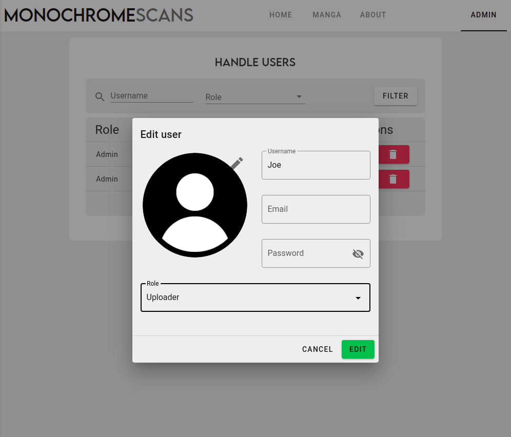

# Monochrome
 My attempt at a generic manga CMS

## Usage
Monochrome requires a copy of this repository, [docker](https://docs.docker.com/engine/install/) 
and [docker-compose](https://docs.docker.com/compose/install/) to run.

Once those requirements are fulfilled you need to set up your [.env](#environment-settings) and simply run 
`make install`, and the different services will be launched.

## Flavors
Two different "flavors" are available:
* `caddy` Includes PWA support, HTTPS (requires a domain name and to be the only web server on the machine),
  and optimisations, the one you most likely want. `make flavor=caddy install`
* `nginx` Same as production but without the HTTPS, in case you have other web servers and
  have a reverse proxy or want to handle the HTTPS yourself (ex. intranet). `make flavor=nginx install`

## Environment settings
Monochrome uses a `.env` file to take your settings,
an example is provided [here](.env.example).

### Variables
*Note: The database should be isolated by docker and only accessible by the Monochrome API, however using 
unique username and password is very recommended.*

* `DB_NAME` Name for the database.
* `DB_USER` User to connect the database with.
* `DB_PWD` Password of that user.
* `SECRET_KEY` Secret used to encrypt the connections, change it asap.
* `SESSION_SECRET_KEY` Secret used to encrypt the session of the client, change it as well.

*Note: Those can and are recommended to be completely random, to generate them you can use* `make secret`

* `PROTOCOL` `http` or `https`, if you use a flavor that doesn't handle HTTPS automatically, you'll still have to set it up on your own.
* `DOMAIN_NAME` The domain the app will be available on, ex: `manga.d34d.one` or `localhost`

* `ACCESS_TOKEN_EXPIRE_MINUTES` Basically after how many minutes a user should be logged out, the default is 6 hours.

* `TITLE` Name of your website, used for stuff like the title of the tab when you open the website.
* `DESCRIPTION` Description of your website.

* `DEFAULT_LANG` Default language.
* `LANGS` Comma separated list of available languages.

## Screenshots
### Home page

### Responsive layout

### Light and dark themes

### Chapter upload

### Website customization

### User management



## WebUI building
In case you want to compile the WebUI static files, you simply have to edit the `.env.webui` file ([details](https://github.com/MonochromeCMS/monochrome-webui#environment-variables)) and run `make build-webui`. This will create the static files inside a `./dist` folder.

## Cloud deployment
The motivation behind the Deta implementation was to have a stateless full stack (the frontend being static already). This would allow us to to deploy Monochrome on the cloud, potentially for free. If you want to go down this route here's a not detailed list of the options you have to do so.
### Backend
All of this is possible because of Deta, which allows us to have a cloud database and file storage for free. To use the deta version of the API you'll need to create a Deta account and obtain a project key, that's all you need for the API to work.

*Note: Deta is good, but if there's another free DB and file storage service out there, the API could be implemented easily enough with those as well.*
### [Monochrome API](https://github.com/MonochromeCMS/monochrome-api-deta)
The API is available as a docker image [`ghcr.io/monochromecms/monochrome-api-deta:latest`](https://github.com/MonochromeCMS/monochrome-api-deta/pkgs/container/monochrome-api-deta), so any service that allows us to run docker containers should be able to host the API.
#### Deta Micros
Actually, the first option doesn't use the docker image, but it fits within the Deta theme. You'll need `git` and [the Deta CLI](https://docs.deta.sh/docs/cli/install).

[](https://go.deta.dev/deploy?repo=https://github.com/MonochromeCMS/monochrome-api-deta)
```
# If you want to go the Deta CLI route:
git clone https://github.com/MonochromeCMS/monochrome-api-deta
cd monochrome-api-deta

deta login
deta new .
deta deploy
deta auth disable
# Set up the .env file ex: https://github.com/MonochromeCMS/monochrome-api-deta/blob/main/.env.example
deta update -e .env
# A deta cron job is available to clean up the lingering upload sessions, more info: https://docs.deta.sh/docs/micros/cron
deta cron set "7 days"
```
You can then use the Deta UI to check the logs and the URL the API is hosted on.

*NOTE: Micros are limited to 128MB per execution, this can be a problem when uploading big chapters,
luckily an increase can be [requested](https://form.deta.dev/memory).*
#### Heroku
[](https://heroku.com/deploy?template=https://github.com/MonochromeCMS/monochrome-api-deta)
#### Google Cloud Run
This one is harder but the one that gives the best performance for free:
- Create a Google Cloud free account (requires a credit card, but doesn't cost anything): https://cloud.google.com
- Copy the image from the GitHub registry into the Google registry: https://cloud.google.com/artifact-registry/docs/docker/pushing-and-pulling
- How to create a Cloud Run service: https://cloud.google.com/run/docs/deploying
*Details:*
- Set the container port to 3000
- 128Mb can be short sometimes, so 256Mb memory is recommended

### [Monochrome WebUI](https://github.com/MonochromeCMS/monochrome-webui)
The frontend is built into static files, either inside a container `make build` or directly to a `dist` folder ([details](https://github.com/MonochromeCMS/Monochrome#webui-building)). So we can either use the same providers as the API and CDNs.
#### Netlify
- Set up the .env.webui file
- Create a Netlify account
- Build the app with `make build-webui`
- Drag and drop the `dist` folder on the Netlify dashboard
- This will give you a Netlify URL, change it to your liking and update the .env.webui file to the new domain name.
- Build the app again and publish it again in Netlify.

### Examples
My production deployment is available on https://manga.d34d.one, it uses the Postgres API inside a VPS.

A demo deployment is available on https://monochromecms.netlify.app, it uses the Deta API inside Google Cloud Run and the website on Netlify.
You can test it out with the user `test:test`, please don't remove or edit it to allow other users to test it out. 

## Services used
Check those, for more information on the services that make Monochrome:
* [Monochrome WebUI](https://github.com/MonochromeCMS/monochrome-webui)
* [Monochrome API - Postgres](https://github.com/MonochromeCMS/monochrome-api-postgres)
* [Monochrome API - Deta](https://github.com/MonochromeCMS/monochrome-api-deta)
  
Credits:
* Base API template: https://github.com/grillazz/fastapi-sqlalchemy-asyncpg
* Logo font: Lemon Milk by [Marsnev](https://marsnev.com/)
