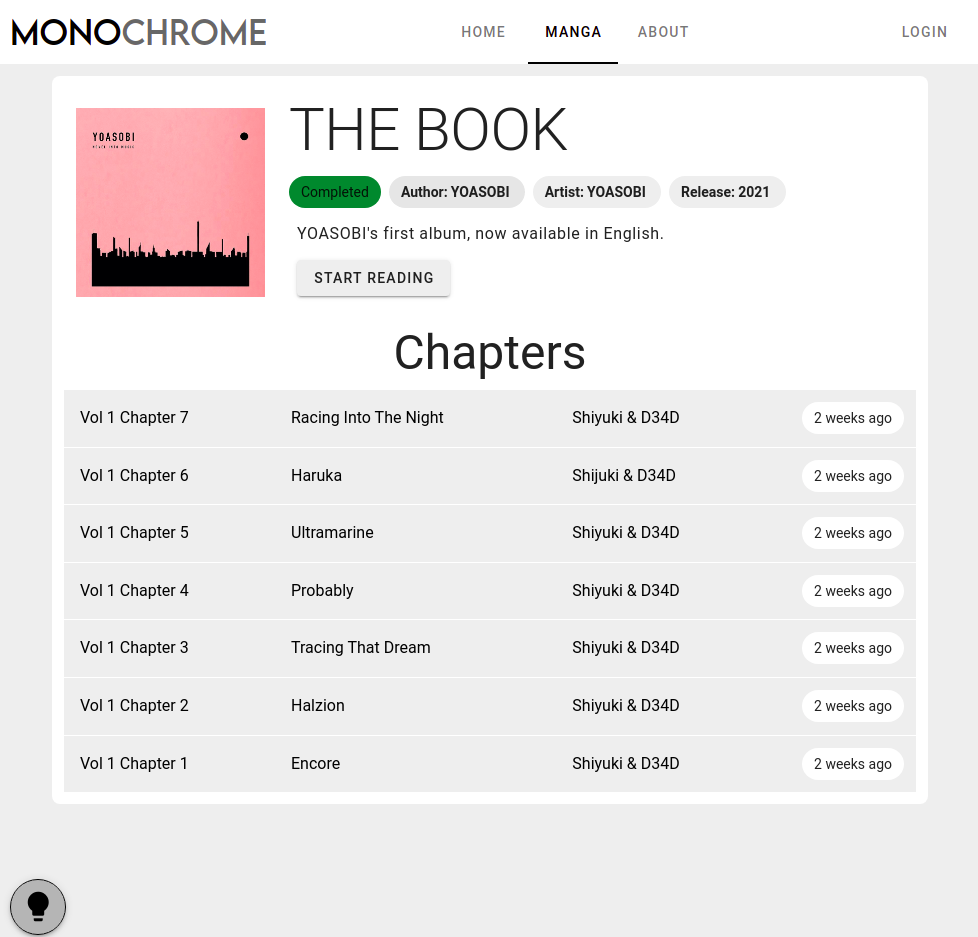
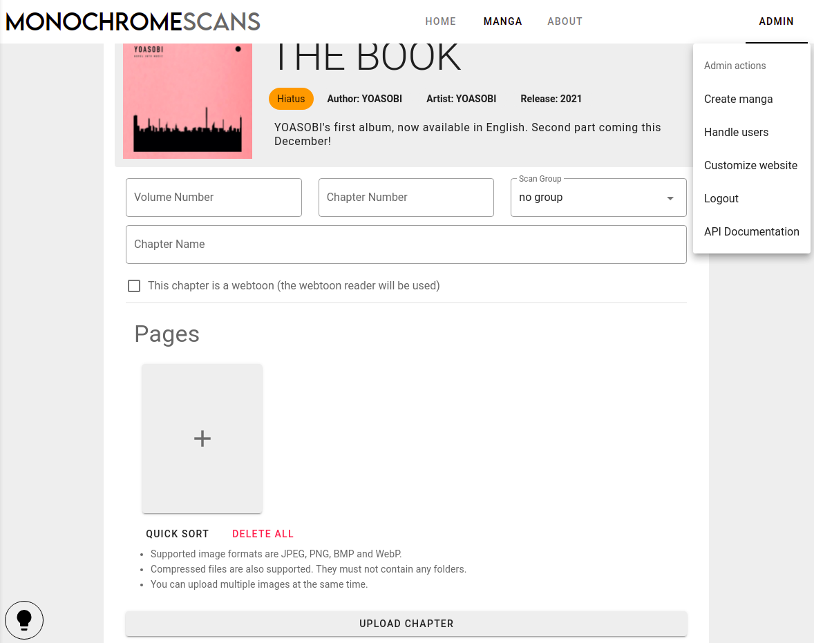

# Monochrome
 My attempt at a generic manga CMS

## Usage
Monochrome requires (at least for now) a copy of this repository, [docker](https://docs.docker.com/engine/install/) 
and [docker-compose](https://docs.docker.com/compose/install/) to run.

Once those requirements are fulfilled you need to set up your [.env](#environment-settings) and simply run 
`make install`, and the different services will be launched.

## docker-compose files
Four different "environments" are available:
* `production` Includes PWA support, HTTPS (requires a domain name and to be the only web server on the machine),
  and optimisations, the one you most likely want. `make install compose_file=docker-compose.prod.yml`
* `production-nginx` Same as production but without the HTTPS, in case you have other web servers and
  have a reverse proxy or want to handle the HTTPS yourself (ex. intranet). `make install compose_file=docker-compose.nginx.yml`
* `development` Only use this one for development or a quick preview. Optimised for development, 
  allows for hot reload and faster builds but skips optimisations: `make install`
* `testing` Used to perform the tests, more info on [Testing](#testing)

## Environment settings
Monochrome uses a `.env` file to take your settings,
an example is provided [here](.env.example).

### Variables
*Note: The database should be isolated by docker and only accessible by the Monochrome API, however using 
unique username and password is very recommended.*

* `DB_NAME` Name for the database.
* `DB_USER` User to connect the database with.
* `DB_PASSWORD` Password of that user.
* `SECRET_KEY` Secret used to encrypt the connections, change it asap.
* `SESSION_SECRET_KEY` Secret used to encrypt the session of the client, change it as well.

*Note: Those can and are recommended to be completely random, to generate them you can use* `make secret`

* `ACCESS_TOKEN_EXPIRE_MINUTES` Basically after how many minutes a user should be logged out, the default is 6 hours.

* `TITLE` Name of your website, used for stuff like the title of the tab when you open the website.
* `DESCRIPTION` Description of your website.

# Screenshots

## Testing
- `make test-back` Launches the backend tests

## Tools used
* API
  * FastAPI
  * SQLAlchemy
  * Alembic
  * Pydantic
* VueJS
  * vuetify
  * vuedraggable

## Progress
* API
  * Creation 🟢100% (new features can always be added)
  * Documentation 🟡58%
    * OpenAPI 🟡66%
    * Cleaner code 🟡50%
  * Testing 🟠40%
    * Unit 🟢100%
    * Integration 🔴10%
* Frontend 
  * Creation 🟢100% (new features can always be added)
    * Latest chapters 🟢100%
    * Manga list 🟢100%
      * Index preview 🟢100%
      * Search 🟢100%
      * Pagination 🟢100%
    * Manga page 🟢100%
      * Chapter list 🟢100%
      * Create manga 🟢100%
      * Edit manga 🟢100%
      * Delete manga 🟢100%
    * Chapter reader 🟢100%
    * Upload chapters 🟢100%
    * Delete chapters 🟢100%
    * Admin 🟢100%
      * Login 🟢100%
      * User management 🟢100%
      * Interface customization 🟢100%
    * About page 🟢100%
  * Cleaner code 🟡??% (basically reading everything back and adding comments and modularity)
  * Testing 🔴0% (It's a pain so no promises)
* Reverse proxy 
  * Creation 🟢100%
    * Developpement build 🟢100%
    * Production build with frontend compilation 🟢100%
* Find a way to deploy this more easily
  * Heroku? (won't work easily bcs we rely on persistent data)
  * Docker swarm? (shouldn't be too hard, but I don't know how useful it'd be)
  * Kubernetes? (not really worth it, expensive and only useful in big environments)
  * Ansible?
  
Credits:
* Base API template: https://github.com/grillazz/fastapi-sqlalchemy-asyncpg
* Logo font: Lemon Milk by [Marsnev](https://marsnev.com/)
